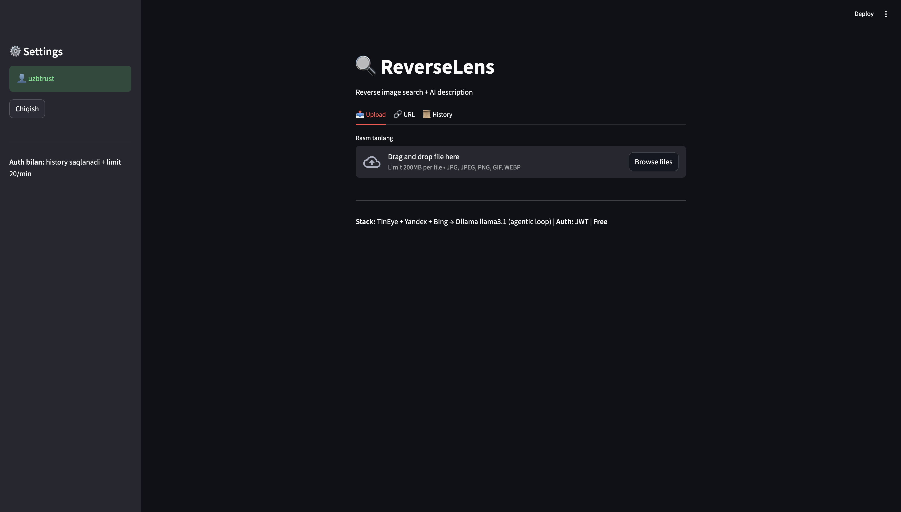
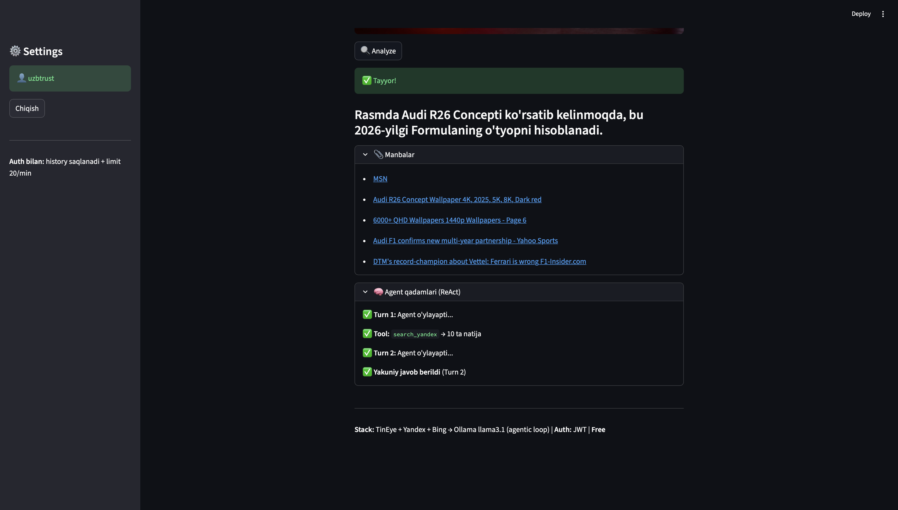
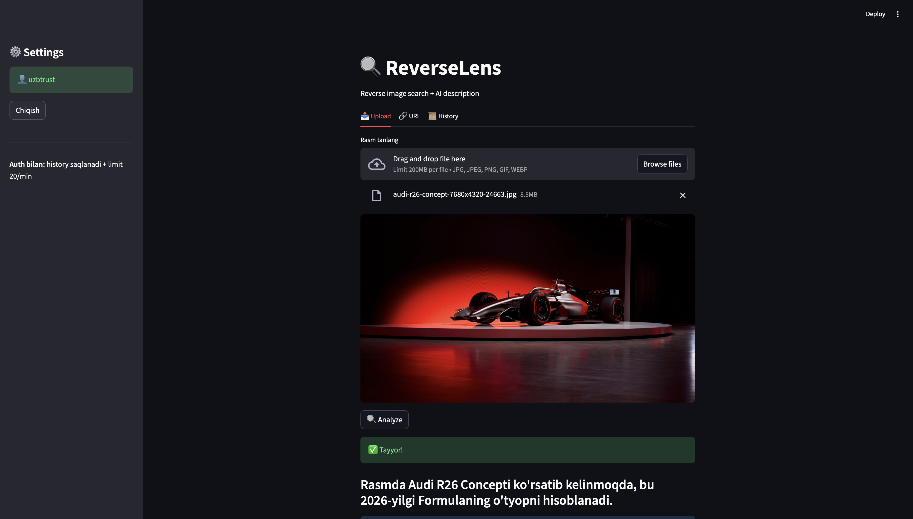
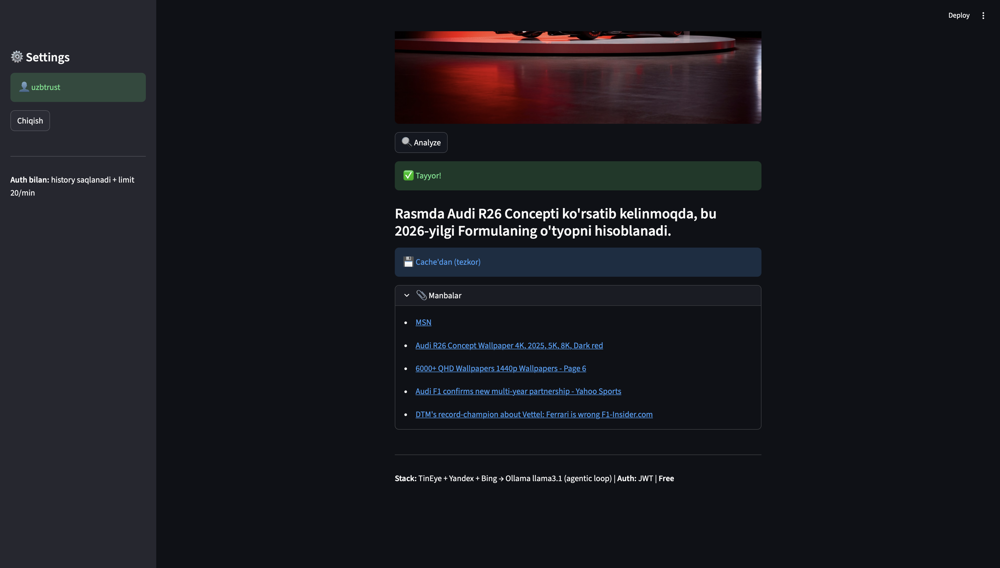

# 🔍 ReverseLens

Autonomous reverse image search agent — upload a photo, the AI agent decides how to search, analyzes results, and describes what's in the image. Powered by ReAct loop + Ollama. Fully free, no paid APIs.

---

## 📸 Screenshots

### Main Page
<p align="center">
  
</p>

### Search Results
> Agent autonomously picked search engines, analyzed results, and generated description

<p align="center">
  
</p>
<p align="center">
  
</p>

### Cached Results
> Same image = instant response from cache, no re-search needed

<p align="center">
  
</p>
<p align="center">
  
</p>

---

## ⚙️ How it works

1. You send an image (upload or URL)
2. Image gets preprocessed (resize, sharpen, contrast)
3. **ReAct Agent** takes over:
   - Agent **autonomously decides** which search engine to use first
   - Executes the search via Ollama native tool calling
   - **Observes** results — enough or not? Agent decides on its own
   - If not enough — agent picks another engine (not hardcoded order)
   - When satisfied — generates description
   - Returns final answer in Uzbek
4. Result saved to SQLite history + JSON cache
5. Authenticated users get higher rate limits + history

### ReAct Loop Example
```
Turn 1: Agent thinks → calls search_tineye → gets 1 result
Turn 2: Agent thinks → "too few, try yandex" → calls search_yandex → 10 results
Turn 3: Agent thinks → enough results → returns final answer
```

The LLM drives the entire workflow. No hardcoded search order.

---

## 🚀 Setup

```bash
cd free_image_agent
python3 -m venv venv
source venv/bin/activate
pip install -r requirements.txt
```

Ollama:
```bash
brew install ollama
brew services start ollama
ollama pull llama3.1
```

Optional (for async queue):
```bash
brew install redis
brew services start redis
```

## ▶️ Run

**Terminal 1 — API:**
```bash
python main.py
```

**Terminal 2 — Web UI:**
```bash
streamlit run app.py
```

**Terminal 3 — Celery worker (optional):**
```bash
celery -A services.tasks worker --loglevel=info
```

---

## 📖 Usage

### Web UI (recommended)
Open http://localhost:8501
- Upload tab: drag-n-drop or file picker
- URL tab: paste image link
- History tab: view past analyses (requires login)

### API

**Public (10 req/min):**
```bash
curl -X POST http://localhost:8000/analyze -F "file=@photo.jpg"
```

**With auth (20 req/min + history):**
```bash
# register
curl -X POST http://localhost:8000/register \
  -H "Content-Type: application/json" \
  -d '{"username":"user1","password":"pass1234"}'

# analyze
curl -X POST http://localhost:8000/analyze/auth \
  -H "Authorization: Bearer YOUR_TOKEN" \
  -F "file=@photo.jpg"

# history
curl http://localhost:8000/history \
  -H "Authorization: Bearer YOUR_TOKEN"
```

**Async (requires Redis):**
```bash
curl -X POST http://localhost:8000/analyze/async -F "file=@photo.jpg"
# returns task_id

curl http://localhost:8000/task/TASK_ID
# returns status + result
```

---

## 🏗️ Architecture

```
free_image_agent/
├── main.py                  # FastAPI + auth + rate limiting + queue
├── app.py                   # Streamlit web UI
├── services/
│   ├── react_agent.py       # ReAct engine (Thought → Action → Observation loop)
│   ├── tools.py             # Tool schemas + dispatch registry
│   ├── agent.py             # Entry point wrapper
│   ├── search.py            # TinEye / Yandex / Bing reverse search
│   ├── analyze.py           # Ollama LLM calls
│   ├── preprocess.py        # Image enhancement
│   └── tasks.py             # Celery async tasks
├── utils/
│   ├── cache.py             # MD5 hash + JSON cache
│   ├── db.py                # SQLite database
│   └── auth.py              # JWT authentication
├── docs/                    # Screenshots
├── static/uploads/          # temp images (auto-cleaned)
├── reverselens.db           # SQLite (auto-created)
├── cache.json
└── requirements.txt
```

---

## 🤖 What makes it a real agent

| Aspect | Before (pseudo-agent) | Now (ReAct agent) |
|--------|----------------------|-------------------|
| Search order | Hardcoded: TinEye → Yandex → Bing | LLM decides autonomously |
| When to stop | `if len(results) >= 5` | LLM evaluates and decides |
| Tool calling | None — Python `if/else` | Ollama native `/api/chat` with `tools` |
| Decision making | 2 yes/no questions | Full reasoning at every step |
| Architecture | Linear pipeline | ReAct loop (Thought → Action → Observation) |

---

## ✨ Features

- 🤖 **ReAct Agent** — LLM autonomously decides search strategy via tool calling
- 📤 **Upload** images (drag-n-drop)
- 🔗 **URL support** — paste image link directly
- 🔄 **Multi-engine search** — TinEye, Yandex, Bing (agent picks)
- 🧠 **Local LLM** — Ollama llama3.1, fully offline
- 💾 **Smart cache** — JSON file, same image = instant
- 🗄️ **SQLite database** — search history per user
- 🔐 **JWT auth** — register/login, protected endpoints
- ⏱️ **Rate limiting** — 10/min public, 20/min authenticated
- 📋 **Async queue** — Celery + Redis for background tasks
- 🖼️ **Image preprocessing** — sharpen, contrast, resize
- 🎨 **Streamlit UI** — clean web interface with agent step visualization

## 🛠 Stack

- **Streamlit** — web UI
- **FastAPI** + uvicorn — API backend
- **PicImageSearch** — reverse image search (TinEye, Yandex, Bing)
- **Ollama** llama3.1 — local LLM with native tool calling (free)
- **SQLite** — user history
- **JWT** — authentication
- **slowapi** — rate limiting
- **Celery + Redis** — async task queue
- **Pillow** — image preprocessing

---

Made with ❤️ by uzbtrust
